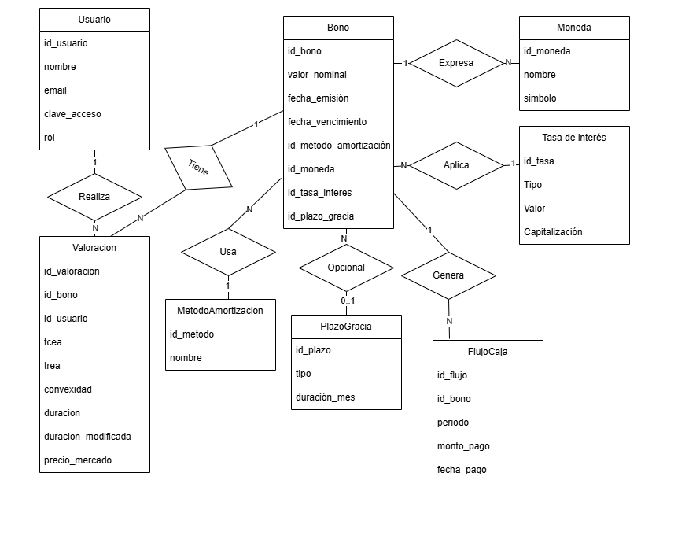
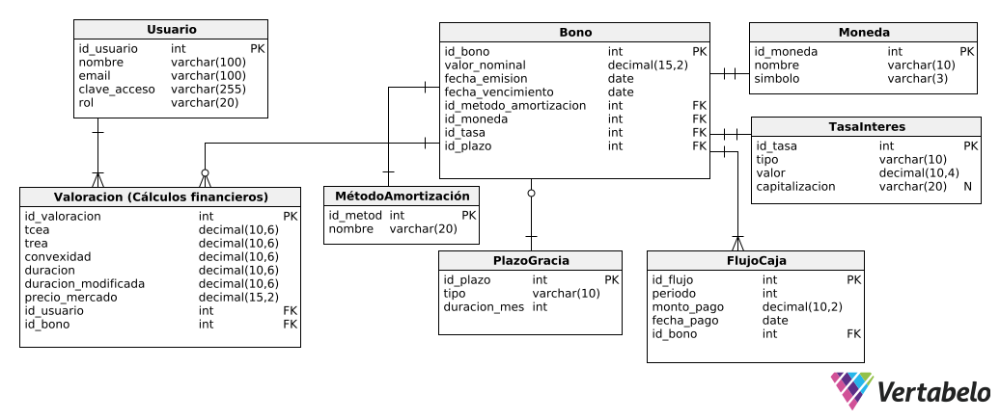

Hola, este es mi primer archivo
# Sistema de Gestión de Bonos Corporativos

## Tema Elegido

**"SISTEMA DE GESTIÓN DE BONOS CORPORATIVOS"**

## Descripción

El trabajo final consistirá en el desarrollo de una aplicación Web o móvil, la que permita implementar un sistema de información que sirva para proyectar el flujo de caja de un Bono Corporativo por el método americano, alemán o francés; además, deberán incluir la posibilidad de otorgar plazos de gracia parciales o totales al inicio del plan de pagos. Como resultados, se deberá incluir el cálculo de la convexidad, duración y duración modificada, la Tasa de Coste Efectivo Anual (TCEA) desde el punto de vista del emisor, la Tasa de Rendimiento Efectivo Anual (TREA) desde el punto de vista del bonista o inversor, así como también, el precio máximo que estaría dispuesto a pagar el mercado por dicho título valor. 
En el sistema a desarrollar, deberá existir la opción de configuración, la que permita definir la moneda, el tipo de tasa de interés que se usará: si es efectiva o nominal (en este caso se deberá definir también a la capitalización). 

## Requerimientos Generales

1. El aplicativo se debe usar autenticando con un usuario y clave de acceso.
2. Se deberá dar de alta las valoraciones de bonos, ingresando los datos completos.
3. Deberá ser posible editar y/o modificar los datos registrados y volverlos a guardar.

## 📌 Entregables (Tarea 1)

## 📌 Entregables (Tarea 2)
[Documentación Técnica (PDF)](ModeloFisico_FinanzasBonos.pdf)

[Script de Creación de la BD](FinanzasBonos_Script.sql)

## 📌 Entregables (Tarea 3)
[Script de Inserción de la BD](SQL_Script_Datos.sql)

## 📌 Entregables (Tarea 4)
[Script de Consultas de la BD](SQL_Script_Consultas.sql)

